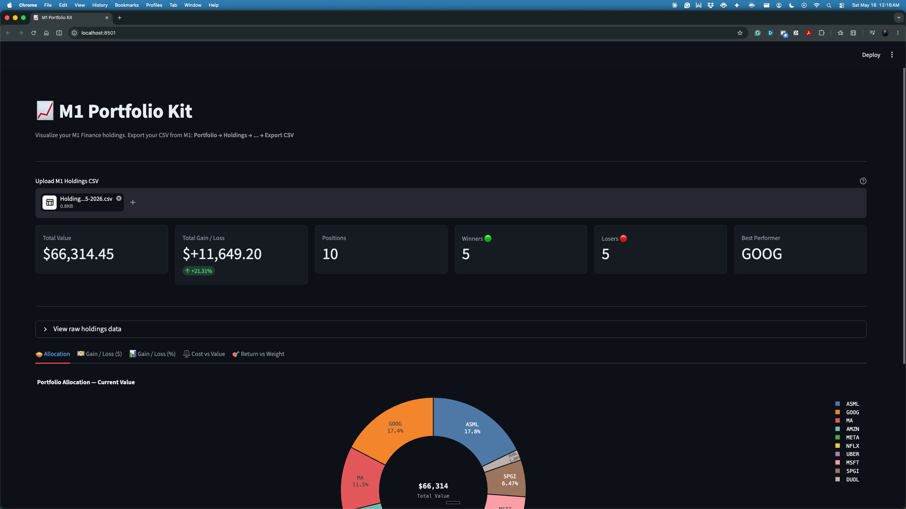

# M1 Portfolio Kit

Better charts for your M1 Finance portfolio. Drop in your holdings CSV and get
interactive visualizations that M1's built-in interface doesn't offer.

Runs entirely on your local machine — your financial data never leaves your computer.



---

## Charts

| Tab                 | What it answers                                                      |
| ------------------- | -------------------------------------------------------------------- |
| 🥧 Allocation       | What percentage of my portfolio is each position?                    |
| 💵 Gain / Loss ($)  | Which positions are making or losing me the most dollars?            |
| 📊 Gain / Loss (%)  | Which positions have the best/worst return rate, regardless of size? |
| ⚖️ Cost vs Value    | What did I pay vs what is it worth now?                              |
| 🎯 Return vs Weight | Are my biggest positions also my best performers?                    |

---

## Setup

Requires Python 3.10+

```bash
git clone https://github.com/JaydotMurf/m1-portfolio-kit.git
cd m1-portfolio-kit
python -m venv venv && source venv/bin/activate  # Windows: venv\Scripts\activate
pip install -r requirements.txt
streamlit run app.py
```

The app opens at `http://localhost:8501`.

---

## Getting your M1 CSV

1. Log in to [M1 Finance](https://m1.com)
2. Go to **Invest → Portfolio → Holdings**
3. Click the **...** overflow menu (top right of the holdings list)
4. Select **Export CSV**
5. Save the file — no renaming needed
6. Upload it in the app

The export includes all positions with cost basis, current value, and unrealized gain/loss.
M1 does not include closed positions in this export.

---

## Contributing

See [CONTRIBUTING.md](CONTRIBUTING.md) for setup, test, and PR instructions.

---

## Roadmap

- [x] Phase 1 — Single snapshot analysis
- [ ] Phase 2 — Multi-snapshot time-series tracking
- [ ] Phase 3 — Benchmark comparison (SPY, QQQ)
- [ ] Phase 4 — Packaging and distribution

---

## License

MIT
