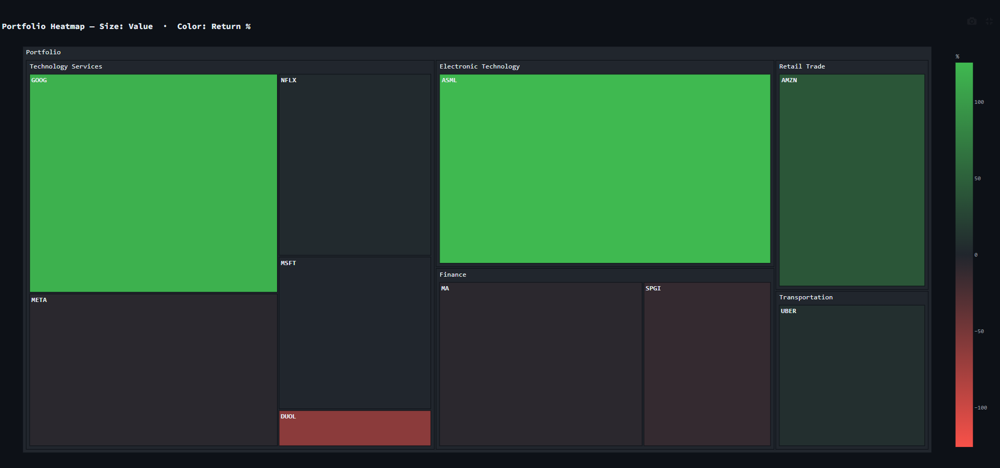

# M1 Portfolio Kit

Better charts for your M1 Finance portfolio. Drop in your holdings CSV and get
interactive visualizations that M1's built-in interface doesn't offer.

Runs entirely on your local machine — your financial data never leaves your computer.



---

## Features

### Charts (Five Interactive Tabs)

| Tab                 | What it answers                                                      |
| ------------------- | -------------------------------------------------------------------- |
| 🥧 Allocation       | What percentage of my portfolio is each position?                    |
| 💵 Gain / Loss ($)  | Which positions are making or losing me the most dollars?            |
| 📊 Gain / Loss (%)  | Which positions have the best/worst return rate, regardless of size? |
| ⚖️ Cost vs Value    | What did I pay vs what is it worth now?                              |
| 🎯 Return vs Weight | Are my biggest positions also my best performers?                    |

### Multi-Snapshot Time-Series Tracking

Upload multiple CSVs to track your portfolio over time:

- **📅 Timeline** — Line chart of total portfolio value across snapshots
- **📈 Position Trend** — Track individual position value and weight across time
- **🔄 Snapshot Diff** — Compare oldest vs newest snapshot side-by-side (new positions, closed positions, value changes)

### User Experience

- **Dark-only theme** — Optimized for financial data visibility, no light mode distraction
- **Color-coded gains/losses** — Green (▲) for gains, red (▼) for losses in the holdings table
- **Professional table formatting** — Title-case headers, clean numeric formatting
- **Local privacy** — All data stays on your machine; no network calls except optional benchmarks (Phase 3)

---

## Setup

### pip (quickest)

```bash
pip install m1-portfolio-kit
m1kit
```

The app opens at `http://localhost:8501`.
To enable the optional SPY/QQQ benchmark overlay: `pip install "m1-portfolio-kit[benchmarks]"`

### From source

Requires Python 3.10+

```bash
git clone https://github.com/JaydotMurf/m1-portfolio-kit.git
cd m1-portfolio-kit
python -m venv venv && source venv/bin/activate  # Windows: venv\Scripts\activate
pip install -r requirements.txt
streamlit run app.py
```

To enable the optional benchmark overlay (SPY/QQQ comparison on the Timeline tab), install the optional dependency: `pip install yfinance`

The app opens at `http://localhost:8501`.

### Docker (no Python required)

```bash
docker build -t m1-portfolio-kit .
docker run -p 8501:8501 m1-portfolio-kit
```

The app opens at `http://localhost:8501`.
To enable the optional SPY/QQQ benchmark overlay, add `RUN pip install yfinance` after the
`pip install -r requirements.txt` line in the Dockerfile before building.

---

## Getting your M1 CSV

1. Log in to [M1 Finance](https://m1.com)
2. Go to **Invest → Portfolio → Holdings**
3. Click the **...** overflow menu (top right of the holdings list)
4. Select **Export CSV**
5. Save the file — no renaming needed
6. Upload it in the app

The export includes all positions with cost basis, current value, and unrealized gain/loss.
M1 does not include closed positions in this export.

---

## Contributing

See [CONTRIBUTING.md](CONTRIBUTING.md) for setup, test, and PR instructions.

---

## Roadmap

- [x] **Phase 1** — Single snapshot analysis (5 charts, summary metrics, local privacy)
- [x] **Phase 2** — Multi-snapshot time-series tracking (timeline, position trends, snapshot diffs)
- [ ] **Phase 3** — Benchmark comparison and risk metrics (SPY/QQQ overlay, HHI, sector mapping)
- [ ] **Phase 4** — Packaging and distribution (Docker, PyPI, releases)

---

## License

MIT
